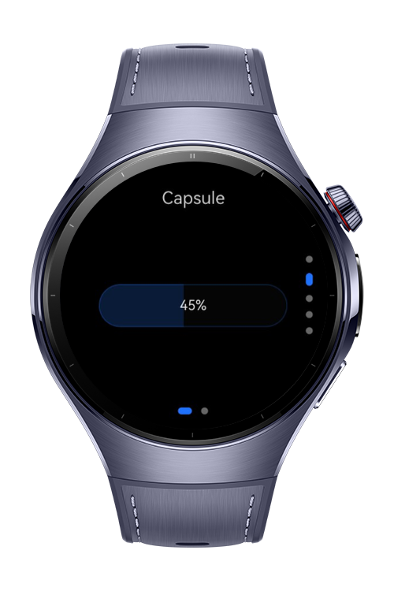
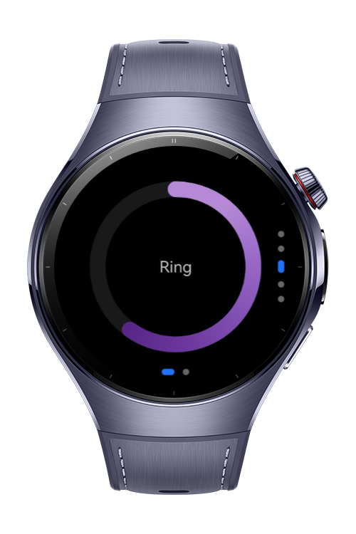
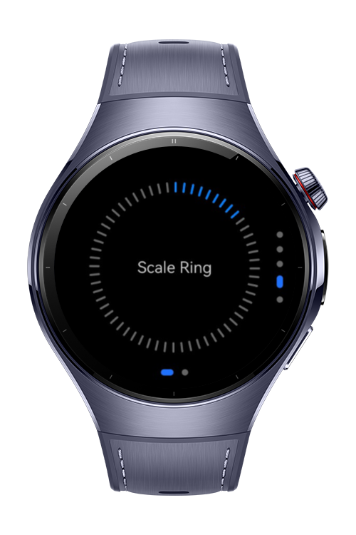
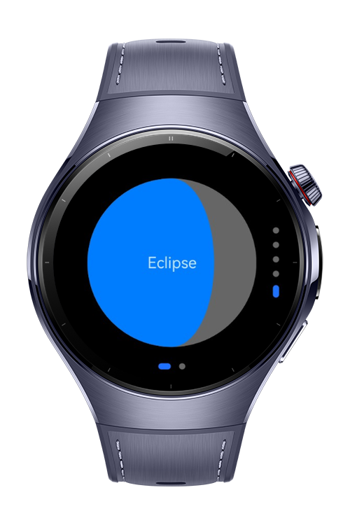

> **Note:** To access all shared projects, get information about environment setup, and view other guides, please visit [Explore-In-HMOS-Wearable Index](https://github.com/Explore-In-HMOS-Wearable/hmos-index).

# How to use and implement the progress component

This codelab shows how to use and customize the Progress component.

# Preview

<div>
  
  
  
  
</div>

# Use Cases

- Create different progress bars and control them.

# Tech Stack

- **Languages**: ArkTS, ArkUI
- **Frameworks**: HarmonyOS SDK 5.1.0(18)
- **Tools**: DevEco Studio Vers 5.1.0.820
- **Libraries**: @kit.ArkUI

# Directory Structure

```
├───components                           
│       Capsule.ets                      
│       Eclipse.ets                      
│       Linear.ets                       
│       Ring.ets                         
│       ScaleRing.ets                                          
├───entryability                         
│       EntryAbility.ets                 
├───entrybackupability
│       EntryBackupAbility.ets
├───model
│       Timer.ets
└───pages
        Index.ets
```

# Constraints and Restrictions

## Supported Device

* Huawei Watch 5

# License

**Progress Codelab** is distributed under the terms of the MIT License
See the [LICENSE](./LICENSE) for more information.